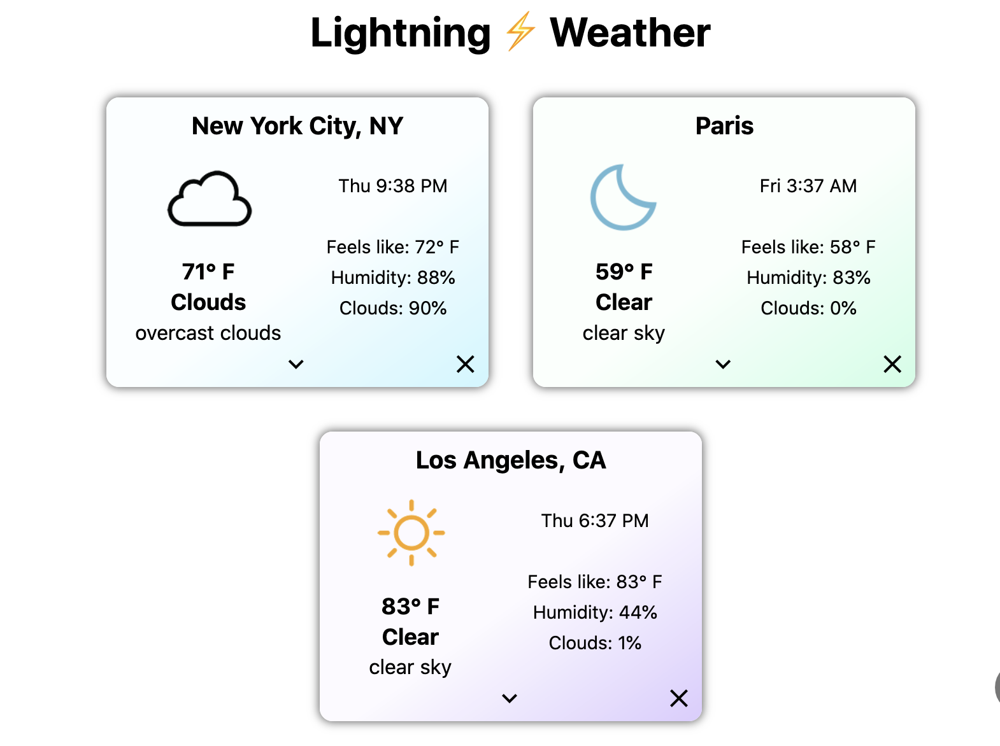

# Lightning ⚡️ Weather
## Dev branch: Day forecast view and hourly charts! :)

### Status/notes:
- Hourly chart using [Chart.js](chartjs.org) seems to be working for the first day of forecast! User can click on the day to access the graph
- First day behavior
    - Usually shows data for the next 12 hours 
    - If the current time is between 12am-6am, the graph will show 6am-6pm (user is likely more interested in the upcoming day's forecast)
- Second day behavior
    - Show 6am-6pm
- Hover over data points to see more data! (Chart.js library is awesome)
- Added fallback text, containing hourly temperature data as a comma-separated list, to the graph's canvas element for accessibility
- Some work on internationalization (units, time display, etc.)

---
A simple, fast weather app created with React and [Next.js](https://nextjs.org/).

[Live Demo here!](https://lightning-weather.vercel.app/)



## Features
- Search for any city/town in the world (if OpenWeatherMap has it in their database)
- Displays the current weather and forecast data from OpenWeatherMap
- User can customize the home screen to show up to four cities
- The app uses Next.js's
[API routes](https://nextjs.org/docs/api-routes/introduction) to get weather data and forecast data from OpenWeatherMap on the server side.
- Data is fetched and cached on the client side using the [SWR](https://swr.vercel.app/) library.
- User settings (units, colors) and saved cities are stored in browser's Local Storage, and retrieved/saved using React Context.


## Building locally
To build/run the app locally, you will need ```npm```, as well as an API key from [OpenWeatherMap](https://openweathermap.org/api). Store the key in a `.env.local` file in the root folder, containing the following:

```
OPENWEATHER_API_KEY=your_key_here
```
This will set up the API key as an Environment Variable for Next.js.


Then, you can run the development server:

```bash
npm run dev
```

Open [http://localhost:3000](http://localhost:3000) with your browser to see the result.

You can also build the app with:

```bash
npm run build
```