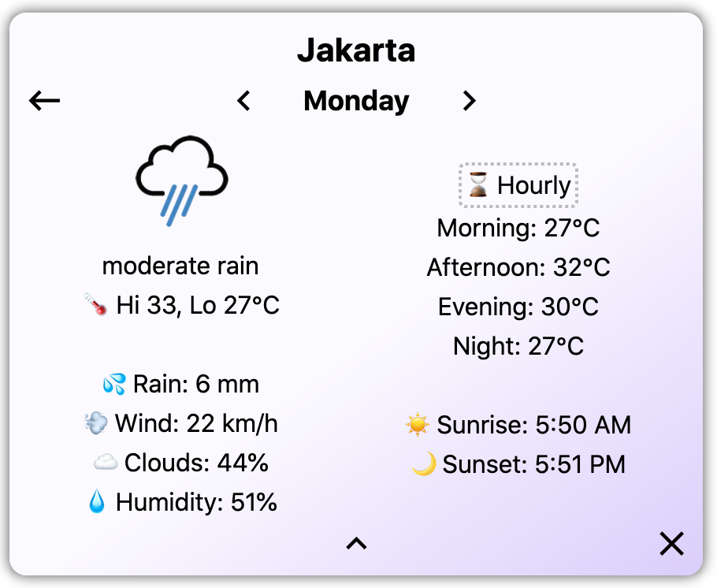

# Lightning ⚡️ Weather
A simple, fast weather app created with React and [Next.js](https://nextjs.org/).

[Live Demo here!](https://lightning-weather.vercel.app/)





## Features
- Displays the current weather and forecast data from OpenWeatherMap
    - Current condition
    - Daily forecast for 7 days
    - Hourly forecast for 2 days
- Search for any city/town in the world (if OpenWeatherMap has it in their database)
- User can customize the home screen to show up to four cities
- The app uses Next.js's
[API routes](https://nextjs.org/docs/api-routes/introduction) to get weather data and forecast data from OpenWeatherMap on the server side.
- Data is fetched and cached on the client side using the [SWR](https://swr.vercel.app/) library.
- User settings (units, colors) and saved cities are stored in browser's Local Storage, and retrieved/saved using React Context.

### Accessibility
- Fully keyboard navigable!
- Turn off colors for higher contrast
- Hourly graph has fallback text for screen readers

### Internationalization
- Switch between metric and imperial
- Time/day and number displays will change according to locale of user, with the help of the browser's [Intl class](https://developer.mozilla.org/en-US/docs/Web/JavaScript/Reference/Global_Objects/Intl)

## Building locally
To build/run the app locally, you will need ```npm```, as well as an API key from [OpenWeatherMap](https://openweathermap.org/api). Store the key in a `.env.local` file in the root folder, containing the following:

```
OPENWEATHER_API_KEY=your_key_here
```
This will set up the API key as an Environment Variable for Next.js.


Then, you can run the development server:

```bash
npm run dev
```

Open [http://localhost:3000](http://localhost:3000) with your browser to see the result.

You can also build the app with:

```bash
npm run build
```